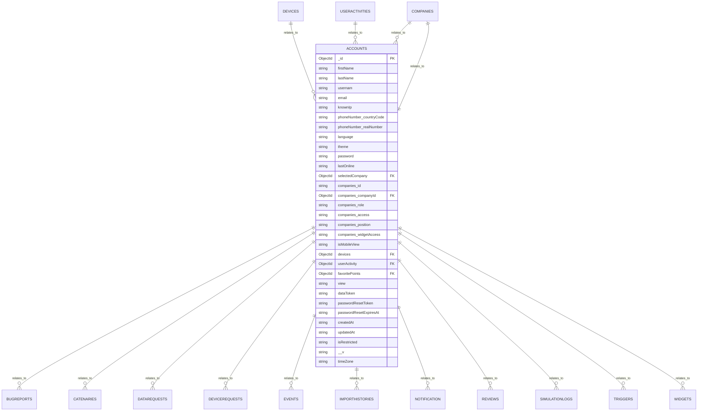

# ACCOUNTS Entity

```mermaid
erDiagram
    ACCOUNTS {
        ObjectId _id PK
        string firstName
        string lastName
        string usernam
        string email
        string knownIp
        string phoneNumber_countryCode
        string phoneNumber_realNumber
        string language
        string theme
        string password
        string lastOnline
        ObjectId selectedCompany FK
        string companies_id
        ObjectId companies_companyId FK
        string companies_role
        string companies_access
        string companies_position
        string companies_widgetAccess
        string isMobileView
        ObjectId devices FK
        ObjectId userActivity FK
        ObjectId favoritePoints FK
        string view
        string dataToken
        string passwordResetToken
        string passwordResetExpiresAt
        string createdAt
        string updatedAt
        string isRestricted
        string __v
        string timeZone
    }
    DEVICES ||--o{ ACCOUNTS : relates_to
    USERACTIVITIES ||--o{ ACCOUNTS : relates_to
    ACCOUNTS ||--o{ BUGREPORTS : relates_to
    ACCOUNTS ||--o{ CATENARIES : relates_to
    COMPANIES ||--o{ ACCOUNTS : relates_to
    COMPANIES ||--|| ACCOUNTS : relates_to
    ACCOUNTS ||--o{ DATAREQUESTS : relates_to
    ACCOUNTS ||--o{ DEVICEREQUESTS : relates_to
    ACCOUNTS ||--o{ EVENTS : relates_to
    ACCOUNTS ||--o{ IMPORTHISTORIES : relates_to
    ACCOUNTS ||--o{ NOTIFICATION : relates_to
    ACCOUNTS ||--o{ REVIEWS : relates_to
    ACCOUNTS ||--o{ SIMULATIONLOGS : relates_to
    ACCOUNTS ||--o{ TRIGGERS : relates_to
    ACCOUNTS ||--o{ WIDGETS : relates_to
```

