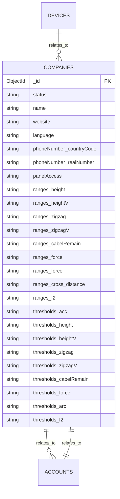

# COMPANIES Entity

```mermaid
erDiagram
    COMPANIES {
        ObjectId _id PK
        string status
        string name
        string website
        string language
        string phoneNumber_countryCode
        string phoneNumber_realNumber
        string panelAccess
        string ranges_height
        string ranges_heightV
        string ranges_zigzag
        string ranges_zigzagV
        string ranges_cabelRemain
        string ranges_force
        string ranges_force
        string ranges_cross_distance
        string ranges_f2
        string thresholds_acc
        string thresholds_height
        string thresholds_heightV
        string thresholds_zigzag
        string thresholds_zigzagV
        string thresholds_cabelRemain
        string thresholds_force
        string thresholds_arc
        string thresholds_f2
    }
    COMPANIES ||--o{ ACCOUNTS : relates_to
    COMPANIES ||--|| ACCOUNTS : relates_to
    DEVICES ||--o{ COMPANIES : relates_to
```

