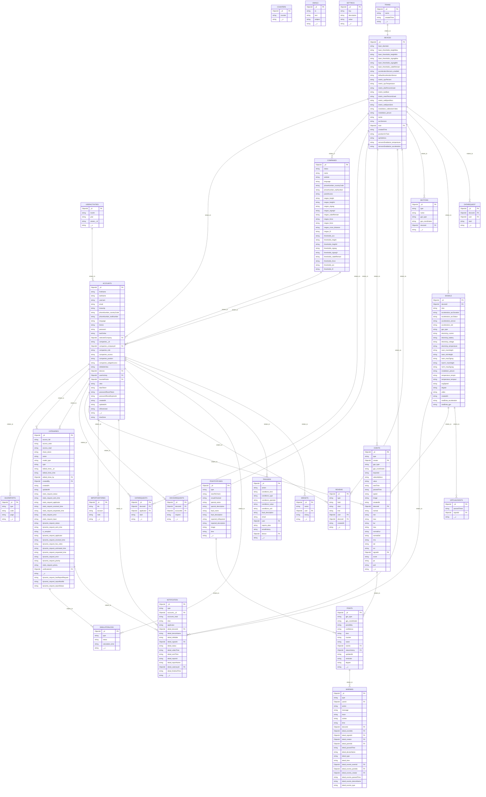

## DB Panto ERD

```mermaid
erDiagram
    ACCOUNTS {
        ObjectId _id PK
        string firstName
        string lastName
        string usernam
        string email
        string knownIp
        string phoneNumber_countryCode
        string phoneNumber_realNumber
        string language
        string theme
        string password
        string lastOnline
        ObjectId selectedCompany FK
        string companies__id
        ObjectId companies_companyId FK
        string companies_role
        string companies_access
        string companies_position
        string companies_widgetAccess
        string isMobileView
        ObjectId devices FK
        ObjectId userActivity FK
        ObjectId favoritePoints FK
        string view
        string dataToken
        string passwordResetToken
        string passwordResetExpiresAt
        string createdAt
        string updatedAt
        string isRestricted
        string __v
        string timeZone
    }
    DEVICES {
        ObjectId _id PK
        string laser_diameter
        string laser_thresholds_heightMax
        string laser_thresholds_heightMin
        string laser_thresholds_zigzagMax
        string laser_thresholds_zigzagMin
        string laser_thresholds_cableRemain
        string accelerationSensors_enabled
        string defaultAccelerationSensor
        string metric_cpuPercent
        string metric_cpuTemperature
        string metric_diskPercentUsed
        string metric_lastBoot
        string metric_memPercentUsed
        string metric_netBytesRecv
        string metric_netBytesSent
        string installation_calibrationVideo
        string installation_picture
        string name
        string accSensors
        ObjectId train FK
        string createdTime
        string positionOnTrain
        string apiAddress
        string sensorsEnablation_temperature
        string sensorsEnablation_acceleration
    }
    USERACTIVITIES {
        ObjectId _id PK
        string month
        string year
        string values__id
        string __v
    }
    BUGREPORTS {
        ObjectId _id PK
        string type
        string code
        string page
        string __v
    }
    CATENARIES {
        ObjectId _id PK
        string access_full
        string access_write
        string access_read
        string share_token
        string name
        string model_type
        string type
        string edited_times__id
        string edited_times_time
        ObjectId edited_times_by FK
        ObjectId createdBy FK
        string createdAt
        string updatedAt
        string static_request_status
        string static_request_sent_time
        string static_request_applicator
        string static_request_received_time
        string static_request_requested_time
        string static_request_error
        string static_request_input
        string dynamic_request_status
        string dynamic_request_sent_time
        string is_sampled
        string dynamic_request_applicator
        string dynamic_request_received_time
        string dynamic_request_has_video
        string dynamic_request_estimated_time
        string dynamic_request_requested_time
        string dynamic_request_error
        string dynamic_request_priority
        string static_request_prioriy
        ObjectId notificationId FK
        string __v
        string dynamic_request_hasReportRequest
        string dynamic_request_reportNotifId
        string dynamic_request_reportStatus
    }
    COMPANIES {
        ObjectId _id PK
        string status
        string name
        string website
        string language
        string phoneNumber_countryCode
        string phoneNumber_realNumber
        string panelAccess
        string ranges_height
        string ranges_heightV
        string ranges_zigzag
        string ranges_zigzagV
        string ranges_cabelRemain
        string ranges_force
        string ranges_force
        string ranges_cross_distance
        string ranges_f2
        string thresholds_acc
        string thresholds_height
        string thresholds_heightV
        string thresholds_zigzag
        string thresholds_zigzagV
        string thresholds_cabelRemain
        string thresholds_force
        string thresholds_arc
        string thresholds_f2
    }
    COUNTERS {
        ObjectId _id PK
        string counter
        string __v
    }
    DATAREQUESTS {
        ObjectId _id PK
        ObjectId deviceId FK
        ObjectId applicator FK
        string start
        string __v
    }
    DEVICEREQUESTS {
        ObjectId _id PK
        ObjectId deviceId FK
        ObjectId accountId FK
        string request
        string __v
    }
    EMAILS {
        ObjectId _id PK
        string to
        string text
        string subject
        string __v
    }
    EVENTS {
        ObjectId _id PK
        string type
        ObjectId creator FK
        string gps_type
        string gps_coordinates
        string imported
        string videoAddress
        string value
        string sentTime
        string passedTime
        string speed
        string image
        string createdAt
        ObjectId deviceId FK
        string normal
        string min
        string max
        string kur
        string max
        string normalKur
        string normalStd
        string rms
        string std
        string zcr
        ObjectId signalId FK
        string score
        string pa
        string psd
        string __v
    }
    IMPORTHISTORIES {
        ObjectId _id PK
        string ids
        string account
        string note
        string __v
    }
    NOTIFICATION {
        ObjectId _id PK
        string type
        ObjectId accounts__id FK
        string accounts_read
        string time
        string applicator
        ObjectId detail_deviceId FK
        string detail_deviceName
        string detial_isMobile
        ObjectId detail_signalId FK
        string detail_status
        string detail_videoTime
        string detail_sentTime
        string detail_reportId
        string detail_reportName
        ObjectId detail_catenaryId FK
        string detail_finishedTime
        string __v
    }
    POINTS {
        ObjectId _id PK
        string gps_type
        string gps_coordinates
        string possibility
        string confidence
        string time
        string counter
        string name
        ObjectId events FK
        ObjectId statusHistory FK
        string updatedAt
        string reminder
        string degree
        string __v
    }
    POINTSTATUSES {
        ObjectId _id PK
        string type
        string needToCheck
        string visualChecked
        string special_name
        string special_description
        string fault_name
        string fault_description
        string repaired_isRepaired
        string repaired_description
        string image
        string time
        string __v
    }
    REVIEWS {
        ObjectId _id PK
        string type
        string field
        string start
        string end
        ObjectId user FK
        ObjectId deviceId FK
        string createdAt
        string __v
    }
    SECTIONS {
        ObjectId _id PK
        string type
        string name
        string gps_type
        string gps_coordinates
        ObjectId deviceId FK
        string __v
    }
    SETTINGS {
        ObjectId _id PK
        string key
        string description
        string value
        string __v
    }
    SIGNALS {
        ObjectId _id PK
        ObjectId deviceId FK
        string time
        string acceleration_accDuration
        string acceleration_accStatus
        string acceleration_sensor
        string acceleration_std
        string gps_type
        string electricity_current
        string electricity_battery
        string electricity_voltage
        string electricity_temperature
        string laser_maxHeight
        string laser_minHeight
        string laser_maxZigzag
        string laserV_maxHeight
        string lserV_maxZigzag
        string installation_picture
        string temperature_tempin
        string temperature_tempout
        string avgSpeed
        string degree
        string video
        string createdAt
        string totalData_acceleration
        string totalData_gps
    }
    SIMULATIONLOGS {
        ObjectId _id PK
        string type
        string status
        string calculation_time
        string __v
    }
    TRAINS {
        ObjectId _id PK
        string name
        string createdTime
        string __v
    }
    TRIGGERS {
        ObjectId _id PK
        string action
        string conditions_kind
        string conditions_type
        string conditions_operator
        string conditions_value
        string conditions_unit
        string fault_description
        string email
        ObjectId user FK
        string reports_data
        string emailHistory
        ObjectId device FK
        string __v
    }
    VIRTUALEVENTS {
        ObjectId _id PK
        string passedTimes
        ObjectId signalId FK
        string __v
    }
    WIDGETS {
        ObjectId _id PK
        string name
        ObjectId user FK
        string timing
        string __v
    }
    WARNING {
        ObjectId _id PK
        string type
        ObjectId userId FK
        string action
        string message
        string trace
        string contex
        string time
        ObjectId deviceId FK
        ObjectId detail_eventIds FK
        ObjectId detail_signalId FK
        ObjectId detail_creator FK
        ObjectId detail_pointIds FK
        string detail_passedTime
        string detail_deviceName
        string detail_type
        string detail_time
        ObjectId detail_events_eventId FK
        ObjectId detail_events_pointIds FK
        ObjectId detail_events_creator FK
        string detail_events_passedTime
        string detail_events_deviceName
        string detail_events_type
    }
    DATAREQUEST {
        ObjectId _id PK
        ObjectId deviceId FK
        ObjectId user FK
        string start
        string __v
    }
    DEVICES ||--o{ ACCOUNTS : relates_to
    USERACTIVITIES ||--o{ ACCOUNTS : relates_to
    ACCOUNTS ||--o{ BUGREPORTS : relates_to
    ACCOUNTS ||--o{ CATENARIES : relates_to
    ACCOUNTS ||--o{ CATENARIES : relates_to
    COMPANIES ||--o{ ACCOUNTS : relates_to
    COMPANIES ||--|| ACCOUNTS : relates_to
    DEVICES ||--o{ COMPANIES : relates_to
    ACCOUNTS ||--o{ DATAREQUESTS : relates_to
    DEVICES ||--o{ DATAREQUESTS : relates_to
    ACCOUNTS ||--o{ DEVICEREQUESTS : relates_to
    DEVICES ||--o{ DEVICEREQUESTS : relates_to
    DEVICES ||--o{ EVENTS : relates_to
    ACCOUNTS ||--o{ EVENTS : relates_to
    ACCOUNTS ||--o{ IMPORTHISTORIES : relates_to
    ACCOUNTS ||--o{ NOTIFICATION : relates_to
    DEVICES ||--o{ NOTIFICATION : relates_to
    EVENTS ||--o{ POINTS : relates_to
    POINTSTATUSES ||--o{ POINTS : relates_to
    DEVICES ||--o{ REVIEWS : relates_to
    ACCOUNTS ||--o{ REVIEWS : relates_to
    DEVICES ||--o{ SECTIONS : relates_to
    DEVICES ||--o{ SIGNALS : relates_to
    SIGNALS ||--o{ NOTIFICATION : relates_to
    SIGNALS ||--o{ EVENTS : relates_to
    ACCOUNTS ||--o{ SIMULATIONLOGS : relates_to
    CATENARIES ||--o{ SIMULATIONLOGS : relates_to
    TRAINS ||--|| DEVICES : relates_to
    DEVICES ||--o{ DATAREQUEST : relates_to
    ACCOUNTS ||--o{ TRIGGERS : relates_to
    SIGNALS ||--o{ VIRTUALEVENTS : relates_to
    ACCOUNTS ||--o{ WIDGETS : relates_to
    POINTS ||--o{ WARNING : relates_to
    CATENARIES ||--o{ NOTIFICATION : relates_to
```

