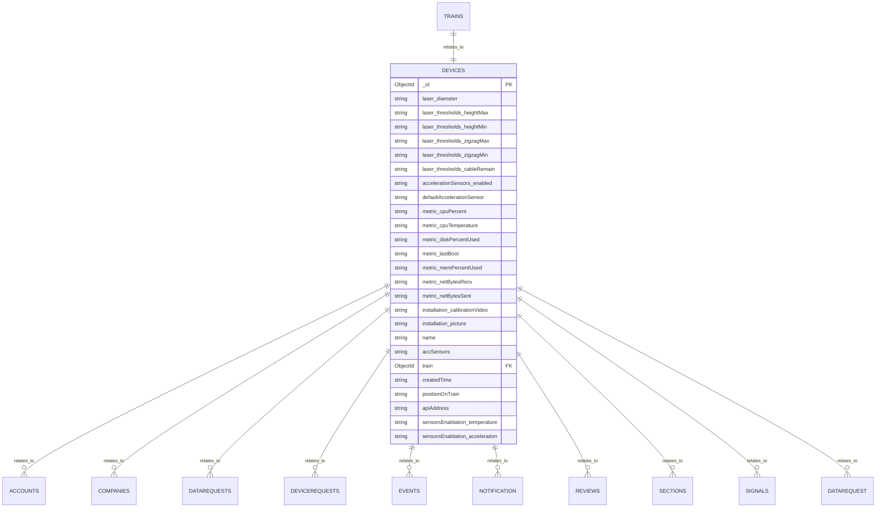

# DEVICES Entity

```mermaid
erDiagram
    DEVICES {
        ObjectId _id PK
        string laser_diameter
        string laser_thresholds_heightMax
        string laser_thresholds_heightMin
        string laser_thresholds_zigzagMax
        string laser_thresholds_zigzagMin
        string laser_thresholds_cableRemain
        string accelerationSensors_enabled
        string defaultAccelerationSensor
        string metric_cpuPercent
        string metric_cpuTemperature
        string metric_diskPercentUsed
        string metric_lastBoot
        string metric_memPercentUsed
        string metric_netBytesRecv
        string metric_netBytesSent
        string installation_calibrationVideo
        string installation_picture
        string name
        string accSensors
        ObjectId train FK
        string createdTime
        string positionOnTrain
        string apiAddress
        string sensorsEnablation_temperature
        string sensorsEnablation_acceleration
    }
    DEVICES ||--o{ ACCOUNTS : relates_to
    DEVICES ||--o{ COMPANIES : relates_to
    DEVICES ||--o{ DATAREQUESTS : relates_to
    DEVICES ||--o{ DEVICEREQUESTS : relates_to
    DEVICES ||--o{ EVENTS : relates_to
    DEVICES ||--o{ NOTIFICATION : relates_to
    DEVICES ||--o{ REVIEWS : relates_to
    DEVICES ||--o{ SECTIONS : relates_to
    DEVICES ||--o{ SIGNALS : relates_to
    TRAINS ||--|| DEVICES : relates_to
    DEVICES ||--o{ DATAREQUEST : relates_to
```

