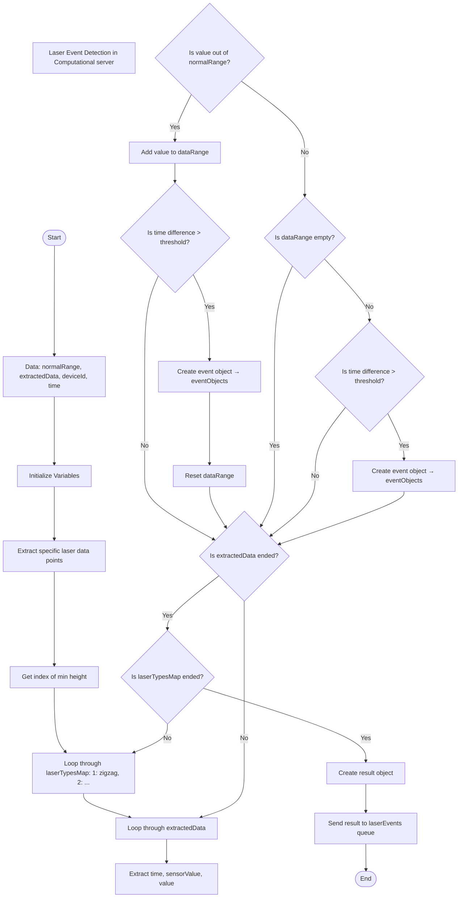

```mermaid
flowchart TD
    q1[Laser Event Detection in Computational server]
    q3([Start])
    q6[Initialize Variables]
    q9([End])
    q10[Add value to dataRange]
    q15[Loop through extractedData]
    q16[Data: normalRange, extractedData, deviceId, time]
    q18[Loop through laserTypesMap: 1: zigzag, 2: ...]
    q19{Is extractedData ended?}
    q20[Extract time, sensorValue, value]
    q22{Is value out of normalRange?}
    q25[Reset dataRange]
    q26[Create event object → eventObjects]
    q33[Extract specific laser data points]
    q34[Get index of min height]
    q35{Is dataRange empty?}
    q40{Is time difference > threshold?}
    q42[Create event object → eventObjects]
    q47{Is time difference > threshold?}
    q52{Is laserTypesMap ended?}
    q65[Create result object]
    q66[Send result to laserEvents queue]

    q3 --> q16
    q16 --> q6
    q6 --> q33
    q33 --> q34
    q34 --> q18
    q18 --> q15
    q15 --> q20

    %% Decision branches with Yes/No labels
    q22 -- Yes --> q10
    q22 -- No --> q35

    q10 --> q47

    q47 -- Yes --> q26
    q47 -- No --> q19

    q26 --> q25
    q25 --> q19

    q35 -- Yes --> q19
    q35 -- No --> q40

    q40 -- Yes --> q42
    q40 -- No --> q19
    q42 --> q19

    q19 -- No --> q15
    q19 -- Yes --> q52

    q52 -- No --> q18
    q52 -- Yes --> q65

    q65 --> q66
    q66 --> q9
```

